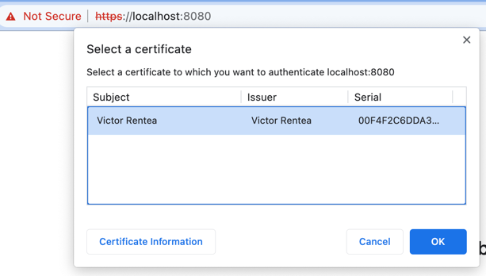

# Key Tool Cheat Sheet

### Generate a private-public key pair and store it in a .jks protected with the password storepass
```
keytool -genkeypair -keysize 2048 -keyalg RSA  -dname cn=A -alias a -keystore a.jks -storepass storepass
```

### See the contents of a JKS
```
keytool -list -keystore a.jks -storepass storepass
```
 
### Export the public key from a KeyPair as a certificate file (.cer)
```
keytool -exportcert -alias a -file a.cer -rfc -keystore a.jks -storepass storepass 
```
 
### Import a .cer file in a .jks as a trusted certificate.
A Java program using this .jks will be able to open a https:// connection to b
```
keytool -import -alias a -file a.cer -keystore b.jks -storepass storepass
```

# 2-SSL (client-cert) between 2 servers

# Client-cert login using a personal certificate (human)
Generate the personal certificate 
```
keytool -genkeypair -keysize 2048 -keyalg RSA  -dname "cn=Victor Rentea" -alias victor -keystore victor.jks -storepass storepass
```

Export the private-public key in a format importable by the OS
```
keytool -importkeystore -srckeystore victor.jks -srcstoretype JKS -destkeystore victor.p12 -deststoretype PKCS12 -srcstorepass storepass -deststorepass storepass -noprompt -J-Dkeystore.pkcs12.legacy
```
Note: -J-Dkeystore.pkcs12.legacy is only needed to import in macOS, that uses some obsolette algorithms by default
https://stackoverflow.com/a/74792849
In macOS open the Keychain Access tool and go to login > My Certificates, and drag and drop the .p12 file 

Import a.cer from the previous steps in "Certificates" section in Keychain Access (for browser to trust localhost)

Import victor.cer in a.jks
keytool -exportcert -alias victor -file victor.cer -rfc -keystore victor.jks -storepass storepass
keytool -import -alias victor -file victor.cer -keystore a.jks -storepass storepass -noprompt

